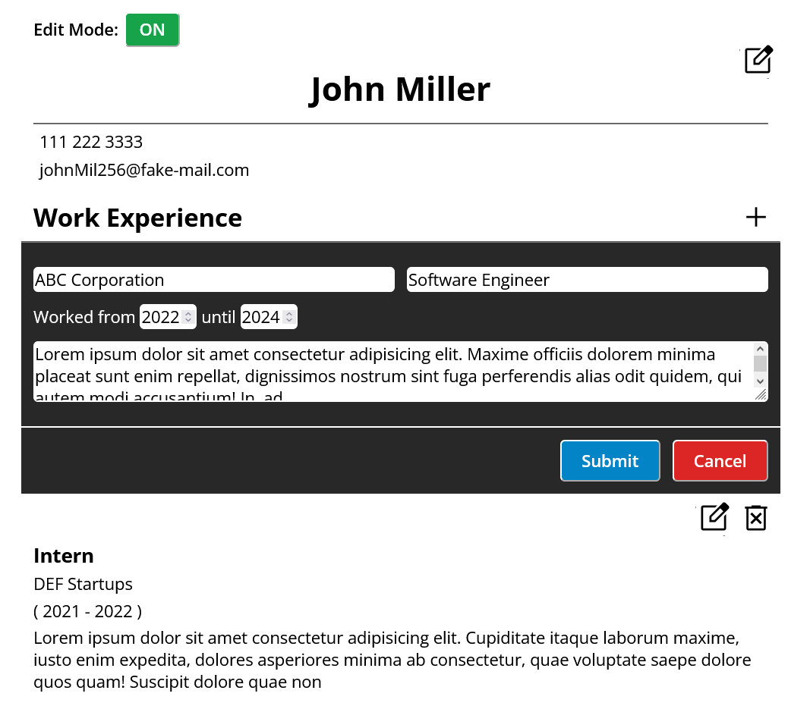
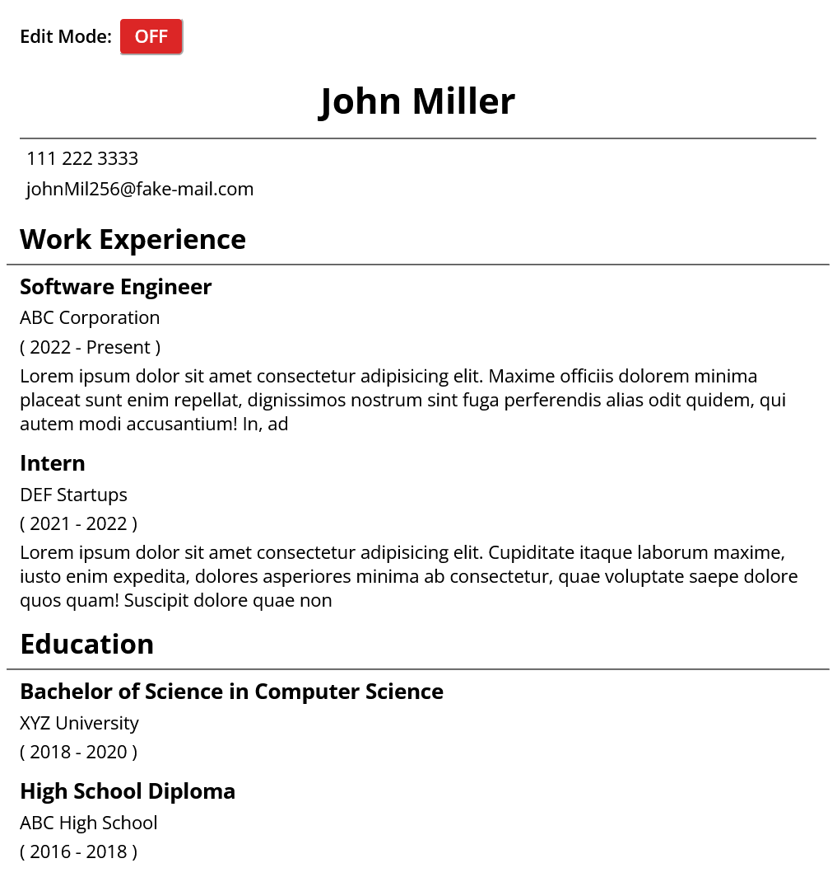

# CV Application

A simple resume builder application built using React, allowing users to create and manage their CV.

- [Live site](https://cv-application-100.netlify.app/)

## Features

- **CV Creation**: Users can create a new CV and add sections such as work experience, education.
- **Section Management**: Users can add, edit and delete sections as needed

## Screenshots

